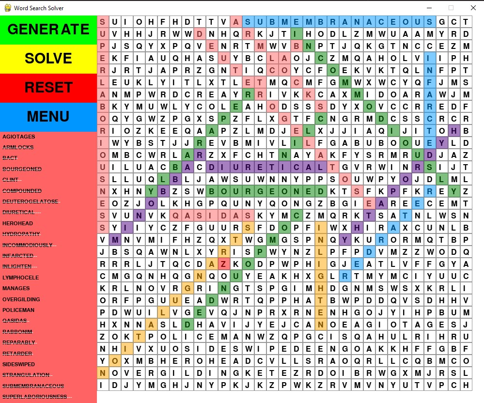

# Word Search Solver and Creator

## Overview

The Word Search Solver and Creator is a Python program that allows users to generate, solve, and interact with word search puzzles. The application provides a graphical user interface (GUI) built using the Pygame library, allowing users to create word search puzzles, solve them, and reset or return to the main menu as needed.

## Features

1. **Generate Word Search Puzzle:**
   - Users can generate a random word search puzzle with a specified number of words.
   - The program strategically places words in different directions (horizontal, vertical, diagonal) on the puzzle grid.

2. **Solve Word Search Puzzle:**
   - The solver functionality helps users find and highlight words on the puzzle grid.
   - It uses different colors to indicate correct or incorrect selections.

3. **Interactive User Interface:**
   - Users can interact with the puzzle grid by clicking and dragging to select words.
   - The GUI includes buttons for solving, resetting, generating a new puzzle, and returning to the main menu.

4. **Menu System:**
   - The application features a menu where users can input the number of words they want in the puzzle.
   - Users can navigate through the menu to generate puzzles with varying difficulty.

## How to Use

1. **Launching the Application:**
   - Ensure you have Python installed on your system.
   - Install the required libraries by running `pip install pygame random-word`.
   - Run the Python script `word_search_solver.py` to launch the application.

2. **Main Menu:**
   - Upon launching, you'll see the main menu where you can input the number of words for the puzzle.
   - Click on the input box, enter the desired number, and press Enter to proceed.

3. **Word Search Interface:**
   - After entering the number of words, the word search puzzle will be generated.
   - You can interact with the puzzle by clicking and dragging to select words.
   - Use the buttons on the side to solve the puzzle, reset the selection, generate a new puzzle, or return to the main menu.

4. **Solving the Puzzle:**
   - Click the "SOLVE" button to activate the solver, which highlights correct word selections in different colors.
   - The solver also provides visual feedback for incorrect selections.

5. **Reset and Generate:**
   - Click the "RESET" button to clear your current word selections.
   - Click the "GENERATE" button to create a new word search puzzle.

6. **Return to Main Menu:**
   - At any point, you can click the "MENU" button to return to the main menu and generate a new puzzle.

## Requirements

- Python (3.7 or higher)
- Pygame
- Random-Word

## Acknowledgments

The Word Search Solver and Creator were developed using Python and the Pygame library. Special thanks to the developers of Pygame for providing a versatile platform for creating interactive applications.
